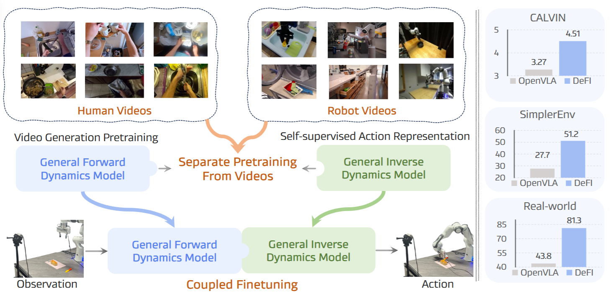

# Disentangled Robot Learning via Separate Forward and Inverse Dynamics Pretraining
### [[Paper]](https://openreview.net/pdf?id=DdrsHWobR1) [[HuggingFace]](https://huggingface.co/zbzzbz/DeFI) 

> **Disentangled Robot Learning via Separate Forward and Inverse Dynamics Pretraining**
> [Wenyao Zhang*](https://zhangwenyao1.github.io/), [Bozhou Zhang*](https://zbozhou.github.io/), [Zekun Qi](https://qizekun.github.io/), [Wenjun Zeng](https://scholar.google.com/citations?user=_cUfvYQAAAAJ&hl=zh-CN), [Xin Jin](https://scholar.google.com/citations?user=byaSC-kAAAAJ&hl=zh-CN), [Li Zhang](https://lzrobots.github.io)   
> **ICLR 2026**

## Abstract
Vision-language-action (VLA) models have shown great potential in building generalist robots, but still face a dilemma–misalignment of 2D image forecasting and 3D action prediction. Besides, such a vision-action entangled training manner limits model learning from large-scale, action-free web video data. To address these issues, we propose DeFI, a novel framework that Decouples visual Forward andInverse dynamics pretraining to exploit respective data sources, wherein video generation and action prediction are disentangled. We introduce the General Forward Dynamics Model (GFDM), pretrained on diverse human and robot videos for future prediction, and the General Inverse Dynamics Model (GIDM), trained via selfsupervised learning to infer latent actions from unlabeled video transitions. These models are then integrated into a unified architecture for end-to-end fine-tuning on downstream tasks. In this manner, GFDM and GIDM first shine separately and then cooperate for mutual benefit. Extensive experiments on CALVIN ABC-D and SimplerEnv demonstrate state-of-the-art performance, with DeFI achieving an average task length of 4.51 for CALVIN, 51.2% success rate on SimplerEnvFractal benchmark and 81.3% success rate in real-world deployment, significantly outperforming prior methods.

## News
- 2026-03, we release the original version of DeFI, which includes pre-training and evaluation on the CALVIN benchmark.

## Pipeline
<div align="center">
  
</div><br/>

## TODO list
- [x] release the original version on the CALVIN benchmark
- [ ] add more benchmarks
- [ ] integrated into lerobot and starvla format

## Environment
```
conda create -n defi python==3.10
conda activate defi

pip install setuptools==57.5.0
git clone --recurse-submodules https://github.com/mees/calvin.git
cd calvin
sh install.sh

cd DeFI_PATH
pip install -r requirements.txt

pip uninstall -y torch torchvision torchaudio
pip install torch==2.1.0 torchvision==0.16.0 torchaudio==2.1.0 --index-url https://download.pytorch.org/whl/cu121
```

## The required checkpoints and data

<details>
<summary><b> Checkpoints </b></summary>

- [stable-video-diffusion-img2vid](https://huggingface.co/stabilityai/stable-video-diffusion-img2vid)
- [clip-vit-base-patch32](https://huggingface.co/openai/clip-vit-base-patch32)
- ["ViT-B-32.pt" (ViT-B/32) in the CLIP](https://github.com/openai/CLIP)
- [t5-base](https://huggingface.co/google-t5/t5-base)

Download these weights and place them in the "ckpts" folder.

</details>

<details>
<summary><b> Data </b></summary>

### Stage 1
For the pre-training of GFDM, we follow the data processing procedure and data format of [VPP](https://github.com/roboterax/video-prediction-policy?tab=readme-ov-file#-stage-1-training-video-model).

Example:
```
data/opensource_robotdata/bridge/
├── annotation/
│   ├── train/
│   └── val/
│       ├── 2.json      ← annotation file
│       └── ... (more json files)
└── videos/
│   ├── train/
│   └── val/
│       ├── 2/
│       │   └── rgb.mp4      ← video file
│       └── ... (more video directories)
└── latent_videos/
    ├── train/
    └── val/
        ├── 2/
        │   └── 0.pt      ← latent video file
        └── ... (more latent video directories)


```
- During training, the JSON files (annotation files) are used, which further reference the PT files (latent video files).
- During evaluation, the JSON files (annotation files) are used, which further reference the MP4 files (video files).

### Stage 2
For the pre-training of GIDM, we follow the data processing procedure and data format of [UniVLA](https://github.com/OpenDriveLab/UniVLA?tab=readme-ov-file#zero-data-preparation).

Example:
```
data/oxe/
├── DOWNLOAD_DIR/
│   ├── fractal20220817_data/
│   ├── language_table/
│   └── ...
└── CONVERSION_DIR/
    ├── fractal20220817_data/
    ├── language_table/
    └── ...
```

### Stage 3
Download the Calvin ABC-D dataset from follow [Calvin](https://github.com/mees/calvin?tab=readme-ov-file#computer--quick-start).

</details>

## Train and eval
```
### Stage 1 Scripts ###

cd Step1_GFDM

# Encode dataset videos with VAE for preprocessing
scripts/prepare_data_latent.sh

# Train FDM
scripts/train_svd.sh

# Evaluate FDM
scripts/eval_svd.sh

### Stage 2 Scripts ###

cd Step2_GIDM

# Train IDM
train.sh

### Stage 3 Scripts ###

cd Step3_DeFI

# Train DeFI
scripts/train_calvin.sh

# Evaluate DeFI
scripts/rollout_calvin.sh

```

## BibTeX
```bibtex
@inproceedings{
zhang2026disentangled,
title={Disentangled Robot Learning via Separate Forward and Inverse Dynamics Pretraining},
author={Wenyao Zhang and Bozhou Zhang and Zekun Qi and Wenjun Zeng and Xin Jin and Li Zhang},
booktitle={The Fourteenth International Conference on Learning Representations},
year={2026},
url={https://openreview.net/forum?id=DdrsHWobR1}
}
```

## Acknowledgements
- [VPP](https://github.com/roboterax/video-prediction-policy)
- [UniVLA](https://github.com/OpenDriveLab/UniVLA)
- [X-VLA](https://github.com/2toinf/X-VLA)
